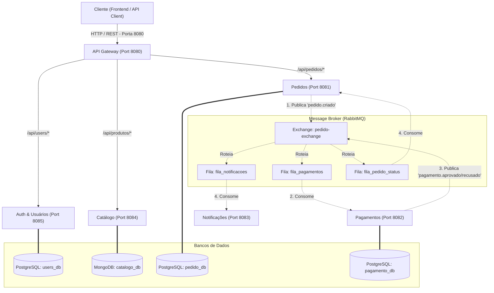

# E-commerce Microservices Platform

Este é um projeto de estudos focado na modelagem, desenvolvimento e implantação de um sistema de e-commerce resiliente e escalável baseado em **Microsserviços** com **Java (Spring Boot)**, **RabbitMQ** e **Docker**.

---

## 🏛️ Arquitetura do Sistema

O sistema é composto por 6 microsserviços desacoplados que utilizam bancos de dados isolados (**Database-per-service**) e se comunicam tanto de forma síncrona (via REST pelo Gateway) quanto assíncrona orientada a eventos (via RabbitMQ).



### Detalhes dos Serviços

1. **[API Gateway](file:///C:/Users/Pedro/Desktop/Projetos_pessoais/ecommerce-model/api-gateway):** Ponto de entrada unificado construído com Spring Cloud Gateway. Gerencia o roteamento reativo para as APIs internas.
2. **[Auth & Usuários (users)](file:///C:/Users/Pedro/Desktop/Projetos_pessoais/ecommerce-model/users):** Gerenciamento de perfis, endereços e autenticação JWT. Base de dados: **PostgreSQL**.
3. **[Catálogo (catalogo)](file:///C:/Users/Pedro/Desktop/Projetos_pessoais/ecommerce-model/catalogo):** Cadastro e listagem de produtos, categorias e controle de estoque. Base de dados: **MongoDB**.
4. **[Pedidos (pedido)](file:///C:/Users/Pedro/Desktop/Projetos_pessoais/ecommerce-model/pedido):** Fluxo de checkout, gestão de carrinho e controle de status do pedido. Base de dados: **PostgreSQL**.
5. **[Pagamentos (pagamento)](file:///C:/Users/Pedro/Desktop/Projetos_pessoais/ecommerce-model/pagamento):** Consumidor do fluxo de pagamentos que simula a integração com adquirentes e processamento de cartões. Base de dados: **PostgreSQL**.
6. **[Notificações (notificacoes)](file:///C:/Users/Pedro/Desktop/Projetos_pessoais/ecommerce-model/notificacoes):** Worker assíncrono que consome eventos do RabbitMQ para disparar e-mails e alertas ao cliente.

---

## 🛠️ Stack Tecnológica

* **Linguagem:** Java 17+
* **Framework:** Spring Boot 4.x & Spring Cloud 2024.0
* **Bancos de Dados:** PostgreSQL 15 & MongoDB 6.0
* **Mensageria:** RabbitMQ (AMQP)
* **Conteinerização:** Docker & Docker Compose
* **Build Tool:** Maven

---

## 📂 Documentação Interna do Projeto

Consulte nossos guias detalhados salvos na pasta dedicada a documentações:

* 📄 **[Plano de Desenvolvimento](file:///C:/Users/Pedro/Desktop/Projetos_pessoais/ecommerce-model/docs/plano_desenvolvimento.md):** O cronograma em fases para execução completa do projeto de estudo.
* 📐 **[Análise de Arquitetura](file:///C:/Users/Pedro/Desktop/Projetos_pessoais/ecommerce-model/docs/analise_arquitetura.md):** Detalhes sobre fluxo de eventos no RabbitMQ e consistência de dados.
* 🎓 **[Melhores Práticas de Microsserviços e POO](file:///C:/Users/Pedro/Desktop/Projetos_pessoais/ecommerce-model/docs/skills/java-microservices-best-practices.md):** O guia com padrões SOLID, Clean Code e padrões de APIs REST a ser seguido em todas as fases.

---

## 🚀 Como Executar o Ambiente Local (Infraestrutura)

Para subir os bancos de dados (PostgreSQL, MongoDB) e o RabbitMQ localmente via Docker, execute o seguinte comando na raiz do projeto:

```bash
docker-compose up -d
```

### Portas Locais dos Serviços Auxiliares
* **PostgreSQL:** `localhost:5432` (Usuário: `postgres`, Senha: `postgres`)
* **MongoDB:** `localhost:27017` (Usuário: `mongo`, Senha: `mongo`)
* **RabbitMQ (AMQP):** `localhost:5672`
* **RabbitMQ Dashboard:** `localhost:15672` (Usuário: `guest`, Senha: `guest`)

---

## ⚙️ Compilação Individual dos Serviços

Cada pasta é um projeto Java Maven independente contendo seu próprio executável `./mvnw`. Para compilar qualquer serviço localmente, navegue até a pasta do serviço correspondente e execute:

```bash
./mvnw clean compile
```
